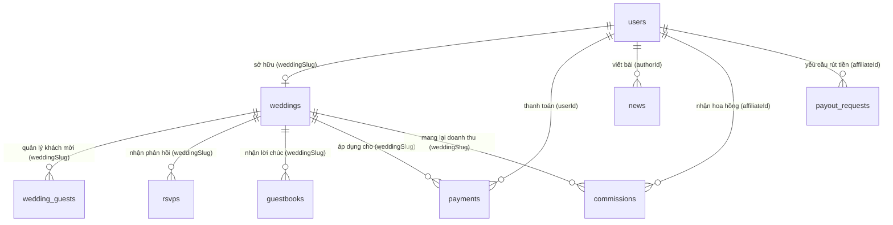

# Tài liệu Thiết kế Cơ sở Dữ liệu (MongoDB / Mongoose) - Viora Studio

Tài liệu này mô tả chi tiết các Collection (Bảng), cấu trúc trường dữ liệu, kiểu dữ liệu, các ràng buộc và mối liên kết (Relationship) giữa các thực thể trong hệ thống Website Thiệp cưới Trực tuyến Viora.

---

## I. Sơ đồ mối liên kết (Entity Relationship Diagram)

Hệ thống sử dụng MongoDB làm cơ sở dữ liệu. Dưới đây là sơ đồ mối quan hệ giữa các Collection thông qua các trường liên kết (Reference):

### Các mối liên kết chính:
1. **Một-Một (One-to-One)**: Một tài khoản `users` sở hữu tối đa một thiệp cưới `weddings` thông qua trường liên kết `weddingSlug` (và ngược lại).
2. **Một-Nhiều (One-to-Many)**:
   - Một thiệp cưới `weddings` có nhiều khách mời `wedding_guests`.
   - Một thiệp cưới `weddings` nhận được nhiều lượt phản hồi tham dự `rsvps` và lời chúc lưu bút `guestbooks`.
   - Một tài khoản `users` có thể thực hiện nhiều giao dịch `payments`.
   - Một tài khoản quản trị/nhân viên `users` có thể viết nhiều bài viết tin tức `news`.

---

## II. Chi tiết các Collections (Bảng dữ liệu)

### 1. Bảng `users` (Quản lý tài khoản)
* **File định nghĩa**: [user.schema.ts](file:///d:/project/Online%20Invitation%20Website/backend/src/user/schemas/user.schema.ts)
* **Tên collection trong MongoDB**: `users`

| Tên trường | Kiểu dữ liệu | Ràng buộc | Giá trị mặc định | Mô tả |
| :--- | :--- | :--- | :--- | :--- |
| `_id` | ObjectId | Khóa chính | Tự sinh | ID duy nhất định danh tài khoản |
| `username` | String | Required, Unique, Indexed | N/A | Tên đăng nhập (Thường là địa chỉ email) |
| `passwordHash`| String | Required | N/A | Mật khẩu tài khoản đã mã hóa |
| `role` | String | Required | `'user'` | Quyền hạn: `'admin'` \| `'staff'` \| `'user'` |
| `weddingSlug` | String | Optional, Indexed | N/A | Liên kết tới slug thiệp cưới mà tài khoản sở hữu |
| `name` | String | Optional | `''` | Tên hiển thị người dùng |
| `phone` | String | Optional | `''` | Số điện thoại liên hệ |
| `email` | String | Optional | `''` | Email nhận thông báo phụ |
| `emailNotification`| Boolean| Required | `true` | Đồng ý nhận thông báo email |
| `showOnHomepage`| Boolean | Required | `true` | Cho phép hiển thị thiệp trên trang chủ |
| `accountType` | String | Required | `'user'` | Loại tài khoản: `'user'` (Khách hàng) \| `'collaborator'` (Cộng tác viên) \| `'admin'` (Quản trị viên) |
| `createdAt` | Date | Tự động | Thời gian tạo | Thời điểm đăng ký tài khoản |
| `updatedAt` | Date | Tự động | Thời gian cập nhật | Thời điểm cập nhật tài khoản gần nhất |

---

### 2. Bảng `weddings` (Nội dung thiệp cưới chi tiết)
* **File định nghĩa**: [wedding.schema.ts](file:///d:/project/Online%20Invitation%20Website/backend/src/wedding/schemas/wedding.schema.ts)
* **Tên collection trong MongoDB**: `weddings`

| Tên trường | Kiểu dữ liệu | Ràng buộc | Giá trị mặc định | Mô tả |
| :--- | :--- | :--- | :--- | :--- |
| `_id` | ObjectId | Khóa chính | Tự sinh | ID định danh thiệp cưới |
| `slug` | String | Required, Unique, Indexed | N/A | Đường dẫn thiệp (Ví dụ: `minh-lan` trong `w/minh-lan`) |
| `templateId` | Number | Required | `1` | ID của mẫu giao diện thiết kế được áp dụng |
| `groomName` | String | Required | N/A | Tên đầy đủ chú rể |
| `groomFatherName`| String | Optional | N/A | Tên cha chú rể |
| `groomMotherName`| String | Optional | N/A | Tên mẹ chú rể |
| `brideName` | String | Required | N/A | Tên đầy đủ cô dâu |
| `brideFatherName`| String | Optional | N/A | Tên cha cô dâu |
| `brideMotherName`| String | Optional | N/A | Tên mẹ cô dâu |
| `weddingDate` | Date | Required | N/A | Ngày tổ chức lễ cưới chính thức |
| `weddingTime` | String | Optional | N/A | Giờ cử hành hôn lễ chính thức |
| `events` | Array[Object] | Mongoose Embedded | `[]` | Danh sách sự kiện cưới (Lễ Vu Quy, Lễ Thành Hôn...) |
| `timeline` | Array[Object] | Mongoose Embedded | `[]` | Dòng sự kiện câu chuyện tình yêu của cặp đôi |
| `galleryImages`| Array[String] | Optional | `[]` | Mảng danh sách các đường dẫn ảnh cưới |
| `giftInfo` | Object | Mongoose Embedded | N/A | Thông tin tài khoản ngân hàng và mã QR nhận quà |
| `contactInfo` | Object | Mongoose Embedded | N/A | Số điện thoại và thông tin liên hệ của CD-CR |
| `views` | Number | Required | `0` | Số lượt truy cập xem thiệp cưới trực tuyến |

---

### 3. Bảng `wedding_guests` (Quản lý khách mời)
* **File định nghĩa**: [guest.schema.ts](file:///d:/project/Online%20Invitation%20Website/backend/src/wedding/schemas/guest.schema.ts)
* **Tên collection trong MongoDB**: `wedding_guests`

| Tên trường | Kiểu dữ liệu | Ràng buộc | Giá trị mặc định | Mô tả |
| :--- | :--- | :--- | :--- | :--- |
| `_id` | ObjectId | Khóa chính | Tự sinh | ID định danh khách mời |
| `weddingSlug` | String | Required, Indexed | N/A | Slug thiệp cưới của chủ nhà mời |
| `name` | String | Required | N/A | Họ và tên khách mời |
| `phone` | String | Optional | N/A | Số điện thoại khách mời |
| `relationship`| String | Optional | N/A | Mối quan hệ: Bạn bè, Họ hàng nhà trai, Đồng nghiệp... |
| `rsvpStatus` | String | Required | `'pending'` | Phản hồi tham dự: `'pending'` \| `'confirmed'` \| `'declined'` |
| `guestsCount` | Number | Required | `0` | Số người đi cùng khi khách xác nhận tham dự |

---

### 4. Bảng `rsvps` (Phản hồi tham dự từ khách vãng lai)
* **File định nghĩa**: [rsvp.schema.ts](file:///d:/project/Online%20Invitation%20Website/backend/src/wedding/schemas/rsvp.schema.ts)
* **Tên collection trong MongoDB**: `rsvps`

| Tên trường | Kiểu dữ liệu | Ràng buộc | Giá trị mặc định | Mô tả |
| :--- | :--- | :--- | :--- | :--- |
| `_id` | ObjectId | Khóa chính | Tự sinh | ID định danh bản phản hồi |
| `weddingSlug` | String | Required, Indexed | N/A | Slug thiệp cưới khách hàng gửi phản hồi |
| `name` | String | Required | N/A | Họ và tên khách gửi phản hồi |
| `attend` | String | Required | `'yes'` | Có tham dự được không: `'yes'` \| `'no'` |
| `guests` | Number | Required | `1` | Tổng số lượng người tham dự đi cùng |
| `message` | String | Optional | N/A | Lời nhắn gửi riêng cho cô dâu và chú rể |

---

### 5. Bảng `guestbooks` (Lưu bút chúc mừng)
* **File định nghĩa**: [guestbook.schema.ts](file:///d:/project/Online%20Invitation%20Website/backend/src/wedding/schemas/guestbook.schema.ts)
* **Tên collection trong MongoDB**: `guestbooks`

| Tên trường | Kiểu dữ liệu | Ràng buộc | Giá trị mặc định | Mô tả |
| :--- | :--- | :--- | :--- | :--- |
| `_id` | ObjectId | Khóa chính | Tự sinh | ID định danh lời chúc |
| `weddingSlug` | String | Required, Indexed | N/A | Liên kết tới thiệp cưới nhận lời chúc |
| `name` | String | Required | N/A | Tên người viết lời chúc |
| `message` | String | Required | N/A | Nội dung lời chúc phúc |

---

### 6. Bảng `invitation_requests` (Yêu cầu tư vấn tạo thiệp)
* **File định nghĩa**: [request.schema.ts](file:///d:/project/Online%20Invitation%20Website/backend/src/request/schemas/request.schema.ts)
* **Tên collection trong MongoDB**: `invitation_requests`

| Tên trường | Kiểu dữ liệu | Ràng buộc | Giá trị mặc định | Mô tả |
| :--- | :--- | :--- | :--- | :--- |
| `_id` | ObjectId | Khóa chính | Tự sinh | ID định danh yêu cầu tư vấn |
| `fullName` | String | Required | N/A | Tên khách hàng cần tư vấn |
| `phoneNumber` | String | Required | N/A | Số điện thoại liên hệ |
| `email` | String | Optional | N/A | Email khách hàng |
| `templateId` | Number | Required | N/A | ID mẫu thiệp khách quan tâm lúc đăng ký |
| `templateName`| String | Required | N/A | Tên mẫu thiệp quan tâm |
| `planName` | String | Required | N/A | Tên gói dịch vụ quan tâm |
| `weddingDate` | Date | Optional | N/A | Ngày cưới dự kiến của khách |
| `notes` | String | Optional | N/A | Yêu cầu hoặc ghi chú thêm từ khách hàng |
| `status` | String | Required | `'pending'` | Trạng thái tư vấn: `'pending'` \| `'contacted'` \| `'completed'` |

---

### 7. Bảng `payments` (Lịch sử thanh toán - Đề xuất thêm)
* **File tham khảo đề xuất**: `src/payment/schemas/payment.schema.ts`
* **Tên collection trong MongoDB**: `payments`

| Tên trường | Kiểu dữ liệu | Ràng buộc | Giá trị mặc định | Mô tả |
| :--- | :--- | :--- | :--- | :--- |
| `_id` | ObjectId | Khóa chính | Tự sinh | ID định danh giao dịch |
| `userId` | ObjectId | Required, Indexed (Ref: `User`) | N/A | ID tài khoản thực hiện giao dịch thanh toán |
| `weddingSlug` | String | Optional | N/A | Giao dịch áp dụng mở khóa cho thiệp cưới này |
| `amount` | Number | Required | N/A | Số tiền giao dịch thanh toán |
| `paymentMethod`| String | Required | `'bank_transfer'` | Phương thức: `'bank_transfer'` \| `'momo'` \| `'vnpay'` |
| `transactionId`| String | Required, Unique, Indexed | N/A | Mã giao dịch từ ngân hàng/cổng thanh toán |
| `status` | String | Required | `'pending'` | Trạng thái: `'pending'` \| `'completed'` \| `'failed'` |
| `planName` | String | Required | N/A | Tên gói mua: `'premium'` \| `'business'` \| `'unlock_template'` |
| `templateId` | Number | Optional | N/A | ID template được mở khóa nếu mua lẻ |

---

### 8. Bảng `news` (Tin tức & Blog - Đề xuất thêm)
* **File tham khảo đề xuất**: `src/news/schemas/news.schema.ts`
* **Tên collection trong MongoDB**: `news`

| Tên trường | Kiểu dữ liệu | Ràng buộc | Giá trị mặc định | Mô tả |
| :--- | :--- | :--- | :--- | :--- |
| `_id` | ObjectId | Khóa chính | Tự sinh | ID định danh bài viết |
| `slug` | String | Required, Unique, Indexed | N/A | Đường dẫn thân thiện SEO của bài viết |
| `title` | String | Required | N/A | Tiêu đề bài viết tin tức |
| `summary` | String | Required | N/A | Tóm tắt nội dung hiển thị trong danh sách tin tức |
| `content` | String | Required | N/A | Nội dung bài viết định dạng Rich Text (HTML/Markdown) |
| `thumbnailUrl` | String | Optional | N/A | Đường dẫn ảnh đại diện bài viết |
| `authorId` | ObjectId | Required (Ref: `User`) | N/A | ID tài khoản nhân viên/admin thực hiện soạn thảo |
| `status` | String | Required | `'draft'` | Trạng thái bài viết: `'draft'` (nháp) \| `'published'` (công khai) |
| `views` | Number | Required | `0` | Số lượt click xem bài viết |
| `tags` | Array[String] | Optional | `[]` | Mảng chứa các từ khóa phân loại bài viết |

---

### 9. Bảng `commissions` (Lịch sử cộng hoa hồng cho CTV)
* **File định nghĩa**: [commission.schema.ts](file:///d:/project/Online%20Invitation%20Website/backend/src/affiliate/schemas/commission.schema.ts)
* **Tên collection trong MongoDB**: `commissions`

| Tên trường | Kiểu dữ liệu | Ràng buộc | Giá trị mặc định | Mô tả |
| :--- | :--- | :--- | :--- | :--- |
| `_id` | ObjectId | Khóa chính | Tự sinh | ID định danh giao dịch hoa hồng |
| `affiliateId` | ObjectId | Required, Indexed (Ref: `User`) | N/A | ID tài khoản CTV nhận tiền hoa hồng |
| `weddingSlug` | String | Required | N/A | Đám cưới mang lại nguồn thu |
| `orderAmount` | Number | Required | N/A | Số tiền khách đã thanh toán mua mẫu thiệp |
| `commissionAmount`| Number | Required | N/A | Số tiền hoa hồng thực nhận của CTV |
| `createdAt` | Date | Tự động | Thời gian tạo | Thời điểm ghi nhận hoa hồng |

---

### 10. Bảng `payout_requests` (Yêu cầu rút tiền từ CTV)
* **File định nghĩa**: [payout-request.schema.ts](file:///d:/project/Online%20Invitation%20Website/backend/src/affiliate/schemas/payout-request.schema.ts)
* **Tên collection trong MongoDB**: `payout_requests`

| Tên trường | Kiểu dữ liệu | Ràng buộc | Giá trị mặc định | Mô tả |
| :--- | :--- | :--- | :--- | :--- |
| `_id` | ObjectId | Khóa chính | Tự sinh | ID định danh yêu cầu rút tiền |
| `affiliateId` | ObjectId | Required, Indexed (Ref: `User`) | N/A | ID tài khoản CTV yêu cầu rút tiền |
| `amount` | Number | Required | N/A | Số tiền muốn rút |
| `bankInfo` | Object | Required | N/A | Thông tin tài khoản ngân hàng nhận tiền ({ bankName, accountName, accountNumber }) |
| `status` | String | Required | `'pending'` | Trạng thái xử lý của Admin: `'pending'` \| `'approved'` \| `'rejected'` |
| `createdAt` | Date | Tự động | Thời gian tạo | Thời điểm gửi yêu cầu rút tiền |
| `updatedAt` | Date | Tự động | Thời gian cập nhật | Thời điểm Admin xử lý duyệt yêu cầu |

