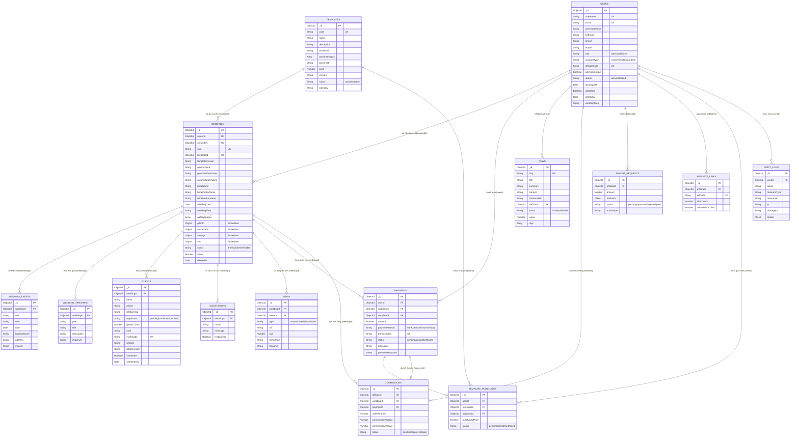

# Tài liệu Thiết kế Cơ sở Dữ liệu (MongoDB / Mongoose) - Viora Studio

Tài liệu này mô tả chi tiết các Collection (Bảng), cấu trúc trường dữ liệu, kiểu dữ liệu, các ràng buộc và mối liên kết (Relationship) giữa các thực thể trong hệ thống Website Thiệp cưới Trực tuyến Viora sau khi đã được tái cấu trúc hoàn tất.

---

## I. Sơ đồ mối liên kết (Entity Relationship Diagram)

Dưới đây là sơ đồ mối quan hệ giữa các Collection thông qua các trường liên kết (Reference):

---

## II. Chi tiết các Collections (Bảng dữ liệu)

### 1. Bảng `users` (Quản lý tài khoản)
* **File định nghĩa**: [user.schema.ts](file:///d:/project/Online%20Invitation%20Website/backend/src/user/schemas/user.schema.ts)
* **Tên collection trong MongoDB**: `users`

| Tên trường | Kiểu dữ liệu | Ràng buộc | Giá trị mặc định | Mô tả |
| :--- | :--- | :--- | :--- | :--- |
| `_id` | ObjectId | Khóa chính | Tự sinh | ID duy nhất định danh tài khoản |
| `username` | String | Required, Unique, Indexed | N/A | Tên đăng nhập |
| `email` | String | Optional, Unique, Indexed | N/A | Địa chỉ email liên hệ nhận thông báo |
| `passwordHash` | String | Required | N/A | Mật khẩu tài khoản đã mã hóa |
| `fullName` | String | Required | `''` | Họ và tên đầy đủ người dùng |
| `phone` | String | Optional | `''` | Số điện thoại liên hệ |
| `avatar` | String | Optional | `''` | Đường dẫn ảnh đại diện |
| `role` | String | Required | `'user'` | Vai trò: `'admin'` \| `'staff'` \| `'user'` |
| `accountType` | String | Required | `'customer'` | Phân loại tài khoản: `'customer'` \| `'affiliate'` \| `'admin'` |
| `affiliateCode`| String | Optional, Unique, Indexed | N/A | Mã CTV giới thiệu duy nhất nếu là affiliate |
| `isEmailVerified`| Boolean | Required | `false` | Trạng thái xác thực email |
| `status` | String | Required | `'active'` | Trạng thái tài khoản: `'active'` \| `'blocked'` |
| `lastLoginAt` | Date | Optional | N/A | Thời gian đăng nhập cuối cùng |
| `isDeleted` | Boolean | Required | `false` | Đánh dấu xóa mềm |
| `deletedAt` | Date | Optional | N/A | Thời gian thực hiện xóa mềm |
| `weddingSlug` | String | Optional | N/A | Slug liên kết ngược với thiệp (tương thích cũ) |

---

### 2. Bảng `refresh_tokens` (Quản lý Refresh Token)
* **File định nghĩa**: [refresh-token.schema.ts](file:///d:/project/Online%20Invitation%20Website/backend/src/auth/schemas/refresh-token.schema.ts)
* **Tên collection trong MongoDB**: `refresh_tokens`

| Tên trường | Kiểu dữ liệu | Ràng buộc | Giá trị mặc định | Mô tả |
| :--- | :--- | :--- | :--- | :--- |
| `_id` | ObjectId | Khóa chính | Tự sinh | ID duy nhất |
| `userId` | ObjectId | Required, Indexed (Ref: `User`) | N/A | Người sở hữu refresh token |
| `tokenHash` | String | Required | N/A | Hash của Refresh Token lưu trữ bảo mật |
| `expiredAt` | Date | Required, TTL Index (0s) | N/A | Thời điểm hết hạn, tự động xóa nhờ TTL Index |

---

### 3. Bảng `password_resets` (Mã khôi phục mật khẩu)
* **File định nghĩa**: [password-reset.schema.ts](file:///d:/project/Online%20Invitation%20Website/backend/src/auth/schemas/password-reset.schema.ts)
* **Tên collection trong MongoDB**: `password_resets`

| Tên trường | Kiểu dữ liệu | Ràng buộc | Giá trị mặc định | Mô tả |
| :--- | :--- | :--- | :--- | :--- |
| `_id` | ObjectId | Khóa chính | Tự sinh | ID duy nhất |
| `userId` | ObjectId | Required, Indexed (Ref: `User`) | N/A | Người yêu cầu đổi mật khẩu |
| `token` | String | Required, Indexed | N/A | Mã token khôi phục mật khẩu |
| `expiredAt` | Date | Required, TTL Index (0s) | N/A | Hết hạn khôi phục mật khẩu, tự động xóa |

---

### 4. Bảng `otps` (Mã xác thực OTP một lần)
* **File định nghĩa**: [otp.schema.ts](file:///d:/project/Online%20Invitation%20Website/backend/src/auth/schemas/otp.schema.ts)
* **Tên collection trong MongoDB**: `otps`

| Tên trường | Kiểu dữ liệu | Ràng buộc | Giá trị mặc định | Mô tả |
| :--- | :--- | :--- | :--- | :--- |
| `_id` | ObjectId | Khóa chính | Tự sinh | ID duy nhất |
| `email` | String | Required, Unique, Indexed | N/A | Email đăng ký nhận OTP |
| `code` | String | Required | N/A | Mã OTP ngẫu nhiên |

---

### 5. Bảng `templates` (Mẫu giao diện thiệp cưới)
* **File định nghĩa**: [template.schema.ts](file:///d:/project/Online%20Invitation%20Website/backend/src/template/schemas/template.schema.ts)
* **Tên collection trong MongoDB**: `templates`

| Tên trường | Kiểu dữ liệu | Ràng buộc | Giá trị mặc định | Mô tả |
| :--- | :--- | :--- | :--- | :--- |
| `_id` | ObjectId | Khóa chính | Tự sinh | ID duy nhất |
| `code` | String | Required, Unique, Indexed | N/A | Mã code giao diện (e.g. `modern-blue`) |
| `name` | String | Required | N/A | Tên giao diện cưới |
| `description`| String | Optional | N/A | Mô tả phong cách thiết kế |
| `thumbnail` | String | Optional | N/A | URL ảnh bìa xem trước |
| `previewImages`| Array[String] | Required | `[]` | Các ảnh demo thiết kế bên trong |
| `previewUrl` | String | Optional | N/A | Link trang xem trực tiếp demo |
| `price` | Number | Required | `0` | Giá mở khóa giao diện (bằng VND) |
| `version` | String | Required | `'1.0.0'` | Phiên bản mã nguồn giao diện |
| `status` | String | Required | `'active'` | Trạng thái hiển thị: `'active'` \| `'inactive'` |
| `category` | String | Optional | N/A | Phân loại danh mục (e.g. `Sang trọng`, `Tối giản`) |

---

### 6. Bảng `template_purchases` (Nhật ký mua giao diện lẻ)
* **File định nghĩa**: [template-purchase.schema.ts](file:///d:/project/Online%20Invitation%20Website/backend/src/template/schemas/template-purchase.schema.ts)
* **Tên collection trong MongoDB**: `template_purchases`

| Tên trường | Kiểu dữ liệu | Ràng buộc | Giá trị mặc định | Mô tả |
| :--- | :--- | :--- | :--- | :--- |
| `_id` | ObjectId | Khóa chính | Tự sinh | ID duy nhất |
| `userId` | ObjectId | Required, Indexed (Ref: `User`) | N/A | Khách hàng thực hiện mua |
| `templateId` | ObjectId | Required, Indexed (Ref: `Template`) | N/A | Template được mua lẻ |
| `paymentId` | ObjectId | Optional, Indexed (Ref: `Payment`) | N/A | Hóa đơn giao dịch thanh toán |
| `purchasedPrice`| Number | Required | N/A | Số tiền thực mua tại thời điểm giao dịch |
| `status` | String | Required | `'completed'` | Trạng thái: `'pending'` \| `'completed'` \| `'failed'` |

---

### 7. Bảng `weddings` (Nội dung thiệp cưới chính)
* **File định nghĩa**: [wedding.schema.ts](file:///d:/project/Online%20Invitation%20Website/backend/src/wedding/schemas/wedding.schema.ts)
* **Tên collection trong MongoDB**: `weddings`

| Tên trường | Kiểu dữ liệu | Ràng buộc | Giá trị mặc định | Mô tả |
| :--- | :--- | :--- | :--- | :--- |
| `_id` | ObjectId | Khóa chính | Tự sinh | ID định danh thiệp cưới |
| `ownerId` | ObjectId | Required, Indexed (Ref: `User`) | N/A | Chủ sở hữu thiệp cưới |
| `slug` | String | Required, Unique, Indexed | N/A | Đường dẫn thiệp (Ví dụ: `minh-lan` trong `/w/minh-lan`) |
| `templateId` | ObjectId | Required (Ref: `Template`) | N/A | ID mẫu giao diện áp dụng cho thiệp này |
| `groomName` | String | Required | N/A | Tên đầy đủ chú rể |
| `groomFatherName`| String | Optional | N/A | Tên cha chú rể |
| `groomMotherName`| String | Optional | N/A | Tên mẹ chú rể |
| `brideName` | String | Required | N/A | Tên đầy đủ cô dâu |
| `brideFatherName`| String | Optional | N/A | Tên cha cô dâu |
| `brideMotherName`| String | Optional | N/A | Tên mẹ cô dâu |
| `weddingDate` | Date | Required | N/A | Ngày tổ chức lễ cưới chính thức |
| `weddingTime` | String | Optional | N/A | Giờ cử hành hôn lễ chính thức |
| `galleryImages`| Array[String] | Required | `[]` | Danh sách link ảnh cưới trong album |
| `giftInfo` | Object | Mongoose Embedded | N/A | Thông tin tài khoản ngân hàng và QR nhận quà |
| `contactInfo` | Object | Mongoose Embedded | N/A | Số điện thoại và thông tin liên hệ |
| `settings` | Object | Mongoose Embedded | RSVP, Guestbook mặc định `true` | Cấu hình bật/tắt RSVP, lưu bút, nhạc nền |
| `seo` | Object | Mongoose Embedded | N/A | Metadata cấu hình SEO (title, description, ogImage) |
| `status` | String | Required, Indexed | `'draft'` | Trạng thái hiển thị: `'draft'` \| `'published'` \| `'hidden'` |
| `views` | Number | Required | `0` | Số lượt truy cập xem thiệp cưới |

---

### 8. Bảng `wedding_events` (Sự kiện cưới chi tiết)
* **File định nghĩa**: [wedding-event.schema.ts](file:///d:/project/Online%20Invitation%20Website/backend/src/wedding/schemas/wedding-event.schema.ts)
* **Tên collection trong MongoDB**: `wedding_events`

| Tên trường | Kiểu dữ liệu | Ràng buộc | Giá trị mặc định | Mô tả |
| :--- | :--- | :--- | :--- | :--- |
| `_id` | ObjectId | Khóa chính | Tự sinh | ID duy nhất |
| `weddingId` | ObjectId | Required, Indexed (Ref: `Wedding`) | N/A | Thuộc về thiệp cưới nào |
| `title` | String | Required | N/A | Tên buổi lễ (Lễ Vu Quy, Lễ Thành Hôn, Tiệc Cưới...) |
| `time` | String | Required | N/A | Thời gian diễn ra sự kiện (e.g. `18:00`) |
| `date` | Date | Required | N/A | Ngày diễn ra sự kiện cưới |
| `locationName`| String | Required | N/A | Tên nhà hàng/địa điểm tổ chức |
| `address` | String | Required | N/A | Địa chỉ chi tiết nơi tổ chức lễ cưới |
| `mapUrl` | String | Optional | N/A | Link nhúng/bản đồ chỉ đường Google Maps |

---

### 9. Bảng `wedding_timelines` (Câu chuyện tình yêu của cặp đôi)
* **File định nghĩa**: [wedding-timeline.schema.ts](file:///d:/project/Online%20Invitation%20Website/backend/src/wedding/schemas/wedding-timeline.schema.ts)
* **Tên collection trong MongoDB**: `wedding_timelines`

| Tên trường | Kiểu dữ liệu | Ràng buộc | Giá trị mặc định | Mô tả |
| :--- | :--- | :--- | :--- | :--- |
| `_id` | ObjectId | Khóa chính | Tự sinh | ID duy nhất |
| `weddingId` | ObjectId | Required, Indexed (Ref: `Wedding`) | N/A | Thuộc về thiệp cưới nào |
| `year` | String | Required | N/A | Năm/Mốc thời gian (e.g. `2021`) |
| `title` | String | Required | N/A | Tiêu đề mốc lịch sử (e.g. `Lần đầu gặp gỡ`) |
| `description`| String | Required | N/A | Mô tả nội dung câu chuyện |
| `imageUrl` | String | Optional | N/A | Link ảnh kỷ niệm đi kèm |

---

### 10. Bảng `guests` (Quản lý khách mời và RSVP)
* **File định nghĩa**: [guest.schema.ts](file:///d:/project/Online%20Invitation%20Website/backend/src/wedding/schemas/guest.schema.ts)
* **Tên collection trong MongoDB**: `guests`

| Tên trường | Kiểu dữ liệu | Ràng buộc | Giá trị mặc định | Mô tả |
| :--- | :--- | :--- | :--- | :--- |
| `_id` | ObjectId | Khóa chính | Tự sinh | ID duy nhất |
| `weddingId` | ObjectId | Required, Indexed (Ref: `Wedding`) | N/A | Thuộc về đám cưới nào |
| `name` | String | Required | N/A | Họ tên khách mời |
| `phone` | String | Optional | N/A | Số điện thoại khách mời |
| `relationship`| String | Optional | N/A | Mối quan hệ phân loại khách mời |
| `rsvpStatus` | String | Required, Indexed | `'pending'` | Trạng thái RSVP: `'pending'` \| `'confirmed'` \| `'declined'` |
| `guestsCount` | Number | Required | `0` | Số người đi cùng khách mời xác nhận |
| `note` | String | Optional | N/A | Lời nhắn gửi của khách (gộp từ bảng rsvps cũ) |
| `inviteCode` | String | Optional, Unique, Indexed, Sparse | N/A | Mã khách mời duy nhất để xem thiệp |
| `qrCode` | String | Optional | N/A | Đường dẫn mã QR để check-in tiệc cưới |
| `tableNumber` | String | Optional | N/A | Số thứ tự bàn tiệc sắp xếp cho khách |
| `checkedIn` | Boolean | Required | `false` | Đã quét mã check-in tại sảnh cưới chưa |
| `checkedInAt` | Date | Optional | N/A | Thời gian điểm danh check-in thực tế |

---

### 11. Bảng `guestbooks` (Lời chúc lưu bút từ khách mời)
* **File định nghĩa**: [guestbook.schema.ts](file:///d:/project/Online%20Invitation%20Website/backend/src/wedding/schemas/guestbook.schema.ts)
* **Tên collection trong MongoDB**: `guestbooks`

| Tên trường | Kiểu dữ liệu | Ràng buộc | Giá trị mặc định | Mô tả |
| :--- | :--- | :--- | :--- | :--- |
| `_id` | ObjectId | Khóa chính | Tự sinh | ID duy nhất |
| `weddingId` | ObjectId | Required, Indexed (Ref: `Wedding`) | N/A | Thuộc về đám cưới nào |
| `name` | String | Required | N/A | Tên khách gửi lời chúc |
| `message` | String | Required | N/A | Nội dung lời chúc phúc |
| `isApproved` | Boolean | Required, Indexed | `true` | Đã duyệt hiển thị trên giao diện thiệp chưa |

---

### 12. Bảng `media` (Quản lý tệp tin đa phương tiện tải lên)
* **File định nghĩa**: [media.schema.ts](file:///d:/project/Online%20Invitation%20Website/backend/src/media/schemas/media.schema.ts)
* **Tên collection trong MongoDB**: `media`

| Tên trường | Kiểu dữ liệu | Ràng buộc | Giá trị mặc định | Mô tả |
| :--- | :--- | :--- | :--- | :--- |
| `_id` | ObjectId | Khóa chính | Tự sinh | ID duy nhất |
| `weddingId` | ObjectId | Optional, Indexed (Ref: `Wedding`) | N/A | Thiệp cưới sử dụng file ảnh này |
| `ownerId` | ObjectId | Required, Indexed (Ref: `User`) | N/A | ID người dùng upload file lên |
| `type` | String | Required, Indexed | `'album'` | Loại: `'avatar'` \| `'cover'` \| `'album'` \| `'other'` |
| `url` | String | Required | N/A | Đường dẫn link tệp tin lưu trữ (e.g. S3/Cloudinary) |
| `size` | Number | Optional | N/A | Kích thước file (đơn vị byte) |
| `mimeType` | String | Optional | N/A | Kiểu tệp tin (e.g. `image/jpeg`) |
| `filename` | String | Optional | N/A | Tên file ban đầu |

---

### 13. Bảng `payments` (Lịch sử giao dịch thanh toán)
* **File định nghĩa**: [payment.schema.ts](file:///d:/project/Online%20Invitation%20Website/backend/src/payment/schemas/payment.schema.ts)
* **Tên collection trong MongoDB**: `payments`

| Tên trường | Kiểu dữ liệu | Ràng buộc | Giá trị mặc định | Mô tả |
| :--- | :--- | :--- | :--- | :--- |
| `_id` | ObjectId | Khóa chính | Tự sinh | ID giao dịch |
| `userId` | ObjectId | Required, Indexed (Ref: `User`) | N/A | Người thanh toán |
| `weddingId` | ObjectId | Optional, Indexed (Ref: `Wedding`) | N/A | Đám cưới được kích hoạt dịch vụ |
| `templateId` | ObjectId | Optional, Indexed (Ref: `Template`) | N/A | Giao diện mở khóa nếu mua lẻ |
| `amount` | Number | Required | N/A | Số tiền thanh toán thực tế (VND) |
| `paymentMethod`| String | Required, Indexed | `'bank_transfer'` | Phương thức: `'bank_transfer'` \| `'momo'` \| `'vnpay'` |
| `transactionId`| String | Required, Unique, Indexed | N/A | Mã tham chiếu giao dịch từ cổng thanh toán |
| `status` | String | Required, Indexed | `'pending'` | Trạng thái: `'pending'` \| `'completed'` \| `'failed'` |
| `planName` | String | Required, Indexed | N/A | Gói cước mua: `'premium'` \| `'business'` \| `'unlock_template'` |
| `providerResponse`| Mixed | Optional | N/A | JSON thô từ gateway ngân hàng để đối soát |

---

### 14. Bảng `news` (Tin tức & Blog)
* **Tên collection trong MongoDB**: `news`

| Tên trường | Kiểu dữ liệu | Ràng buộc | Giá trị mặc định | Mô tả |
| :--- | :--- | :--- | :--- | :--- |
| `_id` | ObjectId | Khóa chính | Tự sinh | ID duy nhất |
| `slug` | String | Required, Unique, Indexed | N/A | Đường dẫn bài viết thân thiện SEO |
| `title` | String | Required | N/A | Tiêu đề bài viết tin tức |
| `summary` | String | Required | N/A | Mô tả tóm tắt ngắn ngoài danh sách |
| `content` | String | Required | N/A | Nội dung bài viết chi tiết định dạng Rich Text |
| `thumbnailUrl` | String | Optional | N/A | Ảnh đại diện tin tức |
| `authorId` | ObjectId | Required (Ref: `User`) | N/A | Người viết bài viết (Thường là Staff/Admin) |
| `status` | String | Required | `'draft'` | Trạng thái xuất bản: `'draft'` \| `'published'` |
| `views` | Number | Required | `0` | Số lượt xem bài viết |
| `tags` | Array[String] | Optional | `[]` | Các tag phân loại tin tức |

---

### 15. Bảng `affiliate_links` (Quản lý Click & Link giới thiệu của CTV)
* **File định nghĩa**: [affiliate-link.schema.ts](file:///d:/project/Online%20Invitation%20Website/backend/src/affiliate/schemas/affiliate-link.schema.ts)
* **Tên collection trong MongoDB**: `affiliate_links`

| Tên trường | Kiểu dữ liệu | Ràng buộc | Giá trị mặc định | Mô tả |
| :--- | :--- | :--- | :--- | :--- |
| `_id` | ObjectId | Khóa chính | Tự sinh | ID duy nhất |
| `affiliateId` | ObjectId | Required, Indexed (Ref: `User`) | N/A | ID của CTV giới thiệu |
| `refCode` | String | Required, Unique, Indexed | N/A | Mã giới thiệu đính kèm link |
| `clickCount` | Number | Required | `0` | Số lượng click chuột vào link |
| `conversionCount`| Number | Required | `0` | Số lượng thiệp/thanh toán thành công qua link |

---

### 16. Bảng `commissions` (Lịch sử ghi nhận hoa hồng cho CTV)
* **File định nghĩa**: [commission.schema.ts](file:///d:/project/Online%20Invitation%20Website/backend/src/affiliate/schemas/commission.schema.ts)
* **Tên collection trong MongoDB**: `commissions`

| Tên trường | Kiểu dữ liệu | Ràng buộc | Giá trị mặc định | Mô tả |
| :--- | :--- | :--- | :--- | :--- |
| `_id` | ObjectId | Khóa chính | Tự sinh | ID duy nhất |
| `affiliateId` | ObjectId | Required, Indexed (Ref: `User`) | N/A | ID CTV nhận tiền hoa hồng |
| `weddingId` | ObjectId | Required, Indexed (Ref: `Wedding`) | N/A | Thiệp cưới mang lại nguồn thu |
| `paymentId` | ObjectId | Required, Indexed (Ref: `Payment`) | N/A | Giao dịch thanh toán nguồn tạo hoa hồng |
| `orderAmount` | Number | Required | N/A | Giá trị thanh toán từ khách mua mẫu thiệp |
| `commissionPercent`| Number | Required | N/A | Phần trăm hoa hồng CTV được hưởng (e.g. `20%`) |
| `commissionAmount`| Number | Required | N/A | Số tiền hoa hồng thực nhận |
| `status` | String | Required, Indexed | `'pending'` | Trạng thái: `'pending'` \| `'approved'` \| `'paid'` |

---

### 17. Bảng `payout_requests` (Yêu cầu rút tiền từ CTV)
* **File định nghĩa**: [payout-request.schema.ts](file:///d:/project/Online%20Invitation%20Website/backend/src/affiliate/schemas/payout-request.schema.ts)
* **Tên collection trong MongoDB**: `payout_requests`

| Tên trường | Kiểu dữ liệu | Ràng buộc | Giá trị mặc định | Mô tả |
| :--- | :--- | :--- | :--- | :--- |
| `_id` | ObjectId | Khóa chính | Tự sinh | ID duy nhất |
| `affiliateId` | ObjectId | Required, Indexed (Ref: `User`) | N/A | Cộng tác viên yêu cầu rút tiền |
| `amount` | Number | Required | N/A | Số tiền yêu cầu rút |
| `bankInfo` | Object | Required | N/A | Thông tin tài khoản bank (`bankName`, `accountName`, `accountNumber`) |
| `status` | String | Required, Indexed | `'pending'` | Trạng thái: `'pending'` \| `'approved'` \| `'rejected'` \| `'paid'` |
| `adminNote` | String | Optional | N/A | Ghi chú của admin khi xử lý yêu cầu rút tiền |

---

### 18. Bảng `audit_logs` (Nhật ký hệ thống)
* **File định nghĩa**: [audit-log.schema.ts](file:///d:/project/Online%20Invitation%20Website/backend/src/audit/schemas/audit-log.schema.ts)
* **Tên collection trong MongoDB**: `audit_logs`

| Tên trường | Kiểu dữ liệu | Ràng buộc | Giá trị mặc định | Mô tả |
| :--- | :--- | :--- | :--- | :--- |
| `_id` | ObjectId | Khóa chính | Tự sinh | ID duy nhất |
| `userId` | ObjectId | Optional, Indexed (Ref: `User`) | N/A | Người thực hiện hành động |
| `action` | String | Required, Indexed | N/A | Hành động thực hiện (e.g. `create_wedding`) |
| `resourceType` | String | Required, Indexed | N/A | Đối tượng tài nguyên bị tác động |
| `resourceId` | String | Optional, Indexed | N/A | ID tài nguyên tương ứng |
| `ip` | String | Optional | N/A | Địa chỉ IP của client |
| `userAgent` | String | Optional | N/A | Trình duyệt client sử dụng |
| `details` | Mixed | Optional | N/A | Thông tin cấu hình chi tiết thay đổi (dưới dạng JSON) |
